## Pavement Crack Segmentation

Created by glee1228@naver.com

Please leave your questions at donghoon.rhie@gmail.com I'll spend as much time as I can to give you a friendly answer.

## Data

* data 디렉토리 아래 
  * crack 디렉토리와 pot 디렉토리에 train, val, test로 데이터셋 구성

* 256 x 256 단위 패치
* 크랙이 없는 부분은 제거


## Usage


학습 데이터 다운로드

### [data-MUHAN.zip 다운로드](https://drive.google.com/drive/folders/1bMdWsK8ls44bZ1X4d5QwXsYUdelP04VT?usp=sharing)

코드 다운로드

```
git clone https://github.com/glee1228/segmentation
```

학습 데이터 위치 설정

```
$ mkdir data; cd data
$ mv 원래 data-MUHAN.zip경로 .
$ unzip data-MUHAN.zip
$ rm data-MUHAN.zip
$ cd ..
```

학습 초기화를 위해 pretrained VGG16 모델 다운로드
```
$ cd model/
$ wget https://download.pytorch.org/models/vgg16-397923af.pth
$ mv vgg16-397923af.pth vgg16.pth
$ cd ..
```
### Train

```
python train.py
```

path 설정 및 에폭 설정 후 실행


### Inference

```
python infer.py
```

path 설정 및 에폭 설정 후 실행


학습 중 validation 데이터는 train 폴더 안에 생성 -> 확인하면서 학습데이터 구성 조절

## Directory configuration
```
├── segmentation
   ├── train.py
   ├── trainer.py
   ├── util.py
   ├── dataproc.py
   ├── model.py
   ├── infer.py
   ├── crop.py
   ├── mask_proc.py
   ├── measure.py
   ├── merge.py
   ├── ransac.py
   ├── severity.py
   ├── model
       ├── vgg16.pth
   ├── train
       ├── images0
       └── HED0.pth
   ├── output
       └── pred
   └── data
       ├── crack
           ├── train
                ├── croppedimg
                └── croppedgt
           ├── val
                ├── croppedimg
                └── croppedgt
           └── test
                ├── croppedimg
                └── croppedgt
       └── pot
           ├── train
                ├── croppedimg
                └── croppedgt
           ├── val
                ├── croppedimg
                └── croppedgt
           └── test
                ├── croppedimg
                └── croppedgt
```


## Table of Contents

* **Datasets**
* **Dataset Evaluation**
* **Additional Dataset (GAPsV2)**
* **How to Download GAPsV2 Dataset**
* **GAPsV2 Data Description**
* **GAPsV2 Dataset Evaluation**

* **Edge Detection Git Repos**

* **Experiments and Evaluation**


## Datasets

**Feature Pyramid and Hierarchical Boosting Network for Pavement Crack Detection** 의 구현 Git Repo 참조

https://drive.google.com/drive/folders/1y9SxmmFVh0xdQR-wdchUmnScuWMJ5_O-

* **GAPs384**
  * Source Image 1920 x 1080(384kb, jpg)
  * Cropped Image **540 x 640** and **540 x 440** (width , height)
  * Dataset Size : 404 Source Images  / 509 Cropped Images
* **cracktree200**
  * Format : 800 x 600(228kb, jpg)
  * Dataset Size : 206 Images
* **CRACK500**
  * Format :**640 x 360**(60kb, jpeg)
  * Dataset Size : Total 3368 Images - Train(1896 Images), Val(348 Images), Test(1124 Images)
* **CFD**
  * Format : 480 x 320 (27kb, jpg)
  * Dataset Size : Total 118 Images
* **AEL**
  * Format : MINSIZE : 700 x 462
    * AIGLE_RN : 991 x 462 (170KB, jpg), 331 x 462 (60KB, jpg)
    * ESAR : 768x 512 (140KB,jpg)
    * LCMS : 700x 1000 (100KB,jpg)
  * Dataset Size : Total 58 Images
    * AIGLE_RN : 38 Images
    * ESAR : 15 Images
    * LCMS : 5 Images


## Dataset Evaluation

> 균열의 촬영 방법마다 시각적으로 이미지가 가지는 특성이 두드러짐.
>
> 가장 사용할 데이터에 적합하다고 판단되는 데이터셋은 GAPs384로 가장 우리 데이터와 흡사한 형태를 갖고 있음.
>
> Domain attributes are prominent for each dataset.
> GAPs384 Data has been determined to be the most suitable data for road crack operations


## Additional Dataset

**Neuroinformatics and Cognitive Robotics Lab** - **GAPsV2**

https://www.tu-ilmenau.de/en/neurob/data-sets-code/gaps/ 


## How to Download GAPsV2 Dataset

Detail : https://www.tu-ilmenau.de/neurob/data-sets-code/gaps/

>GAPs V1,V2 데이터 셋은 각각 별도의 로그인 계정
>
>(요청 후 발급받은 계정)을 통해 다운로드 가능
>
>Each GAPs V1,V2 data set is a separate login account.
>
>Downloadable via accounts issued after request


1. Install gaps-dataset 

```
 pip install gaps-dataset
```

2. Download using Python

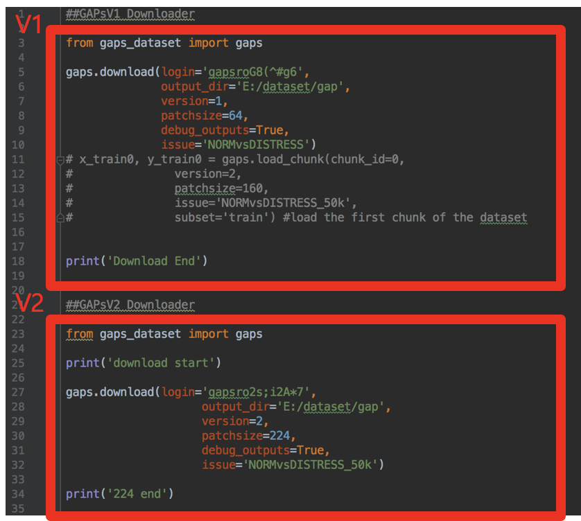


##GAPsV2 Data Description

**German Aspalt Pavement Distress Dataset**

Total 2468 Gray Images(8bit)

1920 x 1080 pixel Size

1.2mm x 1.2mm Per Pixel

---

1417 training Images

51 validation Images

500 validation-test Images

442 test Images

---

여러 패치 크기(160,224,256 etc..) 제공

50k 서브셋(500Mb) 단위로 쪼개서 제공

Provides multiple patch sizes (160,224,256 etc..)

Offered in 50k subset (500Mb)

---

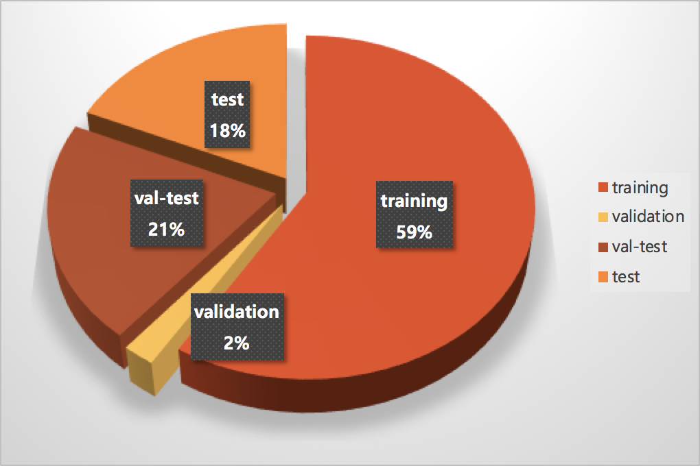


## GAPsV2 Dataset Evaluation

1. Segmentation에 사용할 수 있는 데이터 셋은 test 디렉토리의 442장 이미지 중에서 crack이 포함된 296장의 이미지 활용 가능

   The set of data available for Segmentation is available from Chapter 442 images in the test directory to 296 images with crack

2. Classification에는 Data Aug + ResNet 이 좋은 성능

   Data Aug + ResNet showed good performance in the Classification.

3. Binary Classification(Crack or Not) 문제에서는 F1-Score 0.9 이상

   The Binary Classification (Crack or Not) issue showed F1-Score 0.9 or higher performance.

4. Patch Size는 클수록 좋음

   The larger the patch size, the better

5. ZEB_50k, NORMvsDISTRESS

   50k : Binary Annotation 

   Segmentation (Train, Valid, Valid-test) : Annotation in fraction

   Segmentation(Test) : Segemantion Annotation


## Edge Detection Git Repos

- **Feature Pyramid and Hierarchical Boosting Network for Pavement Crack Detection(FPHBN)** (2019, IEEE TRANSACTIONS ON INTELLIGENT TRANSPORTATION SYSTEMS)  Caffe 코드

  https://github.com/fyangneil/pavement-crack-detection


- **Holistically Nested Edge Detection(HED)** (2015, ICCV) pytorch 코드

  https://github.com/buntyke/pytorch-hed


- **Richer Convolutional Features for Edge Detection(RCF)** (2019, IEEE TRANSACTIONS ON PATTERN ANALYSIS AND MACHINE INTELLIGENCE / 2017, CVPR ) pytorch 코드

  https://github.com/meteorshowers/RCF-pytorch


- **CASENet: Deep Category-Aware Semantic Edge Detection** (2017, CVPR) 

  https://github.com/milongo/CASENet


## Experiments and Evaluation

* ##GAPs384 (HED)

  | **ODS   (fixed contour threshold)** | **GAPs(original size)** | **GAPs(256x256)** |
  | :---------------------------------: | :---------------------: | :---------------: |
  |               **130**               |          0.707          |       0.676       |
  |               **150**               |          0.713          |       0.628       |
  |               **170**               |          0.710          |       0.749       |
  |               **190**               |          0.698          |       0.628       |
  |               **210**               |          0.669          |       0.668       |
  |               **230**               |          0.602          |       0.733       |

  **Example)**

  **f1-score by fixed threshold**

  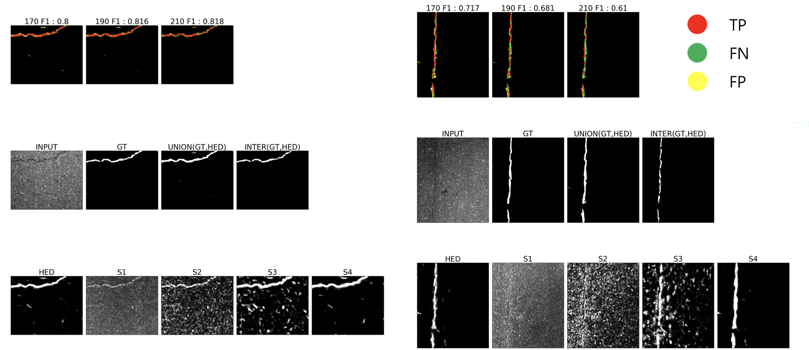

  

  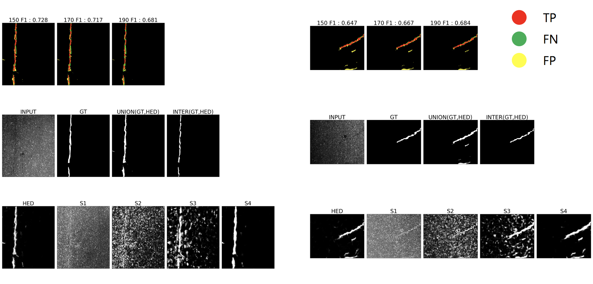

  

  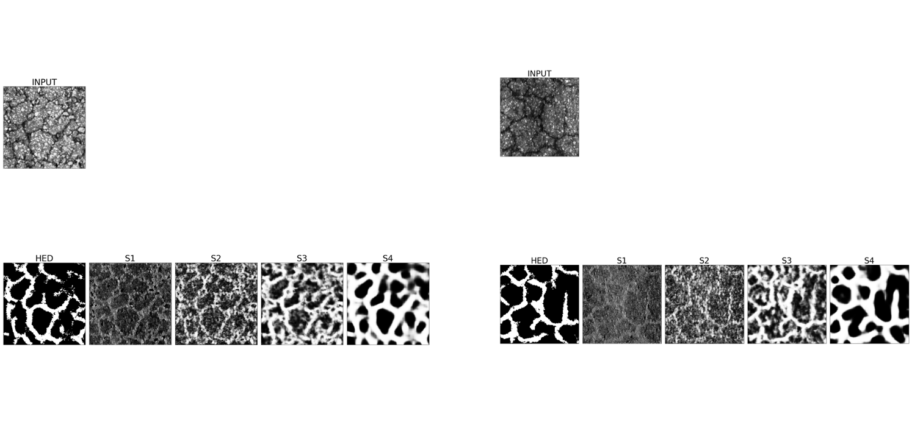

- ## Compare by dataset

  **(train MUHAN , test :  1. GAPs384 , 2. MUHAN , 3. MUHAN+GAPs384)**

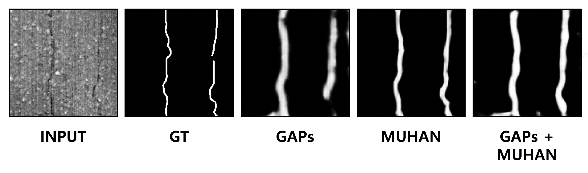

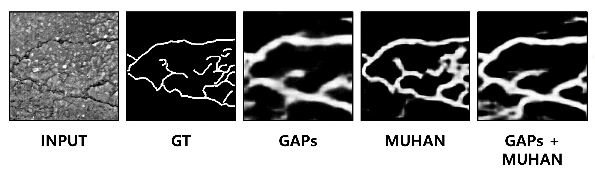


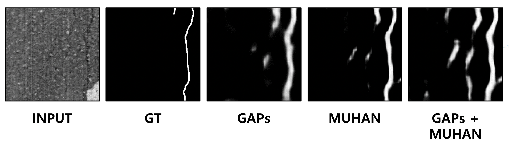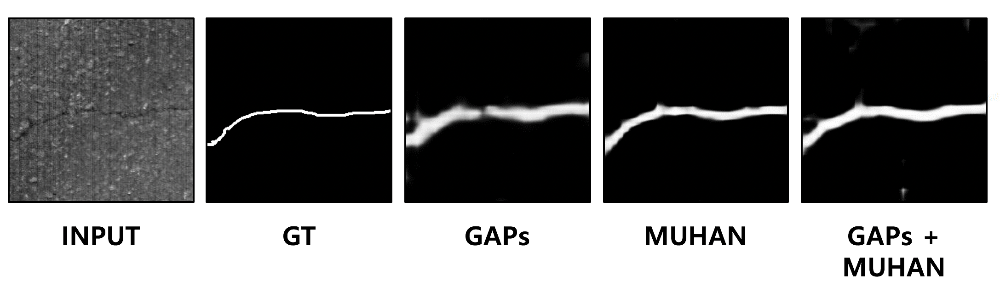

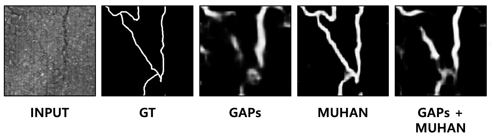

## HED Network Description

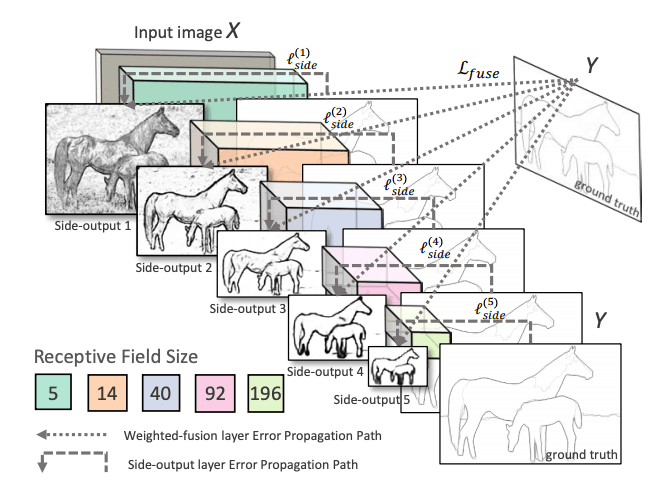

구조는 위의 이미지와 같다.

네트워크의 아이디어는 scale pyramid를 통해 좋은 하나의 결과를 만들자이다.

여러개의 receptive field size로 convolution을 하는데, 병렬적으로 하지 않고, 직렬로 한다.

따라서, 첫번째에서 뽑은 feature를 토대로 두 번째, 세 번째 차례로 점점 더 중요하게 여길 부분을 공략하게 만든다.

Receptive field가 점점 커지기 때문에, 레이어마다 출력 feature 크기는 작지만, 선형 보간을 이용해 입력 이미지와 동일한 크기로 키워서 차곡차곡 겹치게 한 후, convolution을 시행하여 최종 결과물을 만든다.


각 레이어의 feature마다 sigmoid함수 출력 값(0~1)을 합하여 back-prop한다.


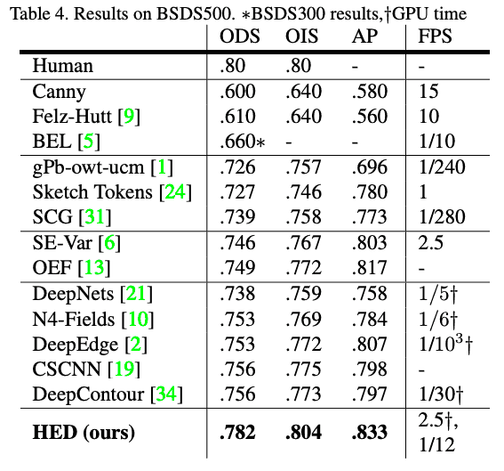

HED의 성능 평가 결과는 해당 논문에서 제시한 표에서 확인할 수 있다.


이 모델을 Pavement crack detection 도메인에 적용시키면서 성능을 개선시키고자 한 Feature Pyramid Hierarchical boosting Network(FPHBN) 이 있다.

https://arxiv.org/abs/1901.06340

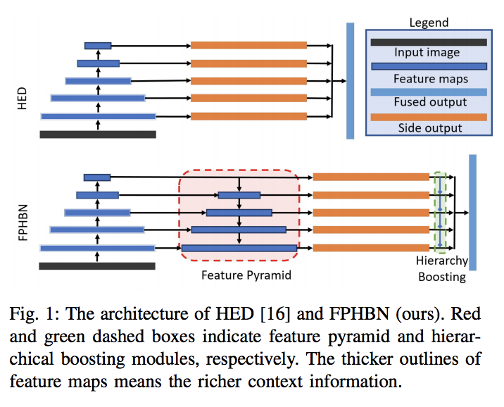

중간 side output 결과 이전에 feature pyramid를 삽입해 마지막 레이어에서 강한 영향을 받는 기존 HED 모델을 개선시켰다. 못 알아보던 feature들을 더 잘 알아 볼 수 있게 공략하는 것이다.

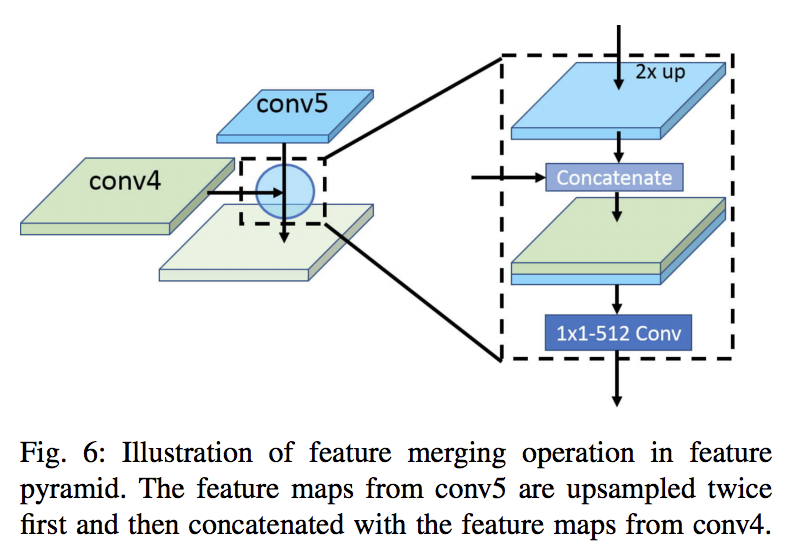

